# User guide

Trial Eligibility Support checks a patient profile against a clinical trial protocol. Six
cooperating agents return one of three answers: **Eligible**, **Not eligible** or
**More information required**. Every decisive finding cites the protocol page it came from.

> **Human review is always required.** The app supports, and never replaces, review by a
> qualified clinician or trial investigator. Unknown values are reported, never guessed.
> Use synthetic data only.

- Live app: https://clinical-trial-eligibility-app.onrender.com (free plan: the first request after
  an idle period takes about a minute)
- Demo login: `demo@example.org` / `demo-password-123`, or click **Use the demo account**
- Demo video and screenshots: see [`demo/README.md`](../demo/README.md)

---

## 1. Sign in

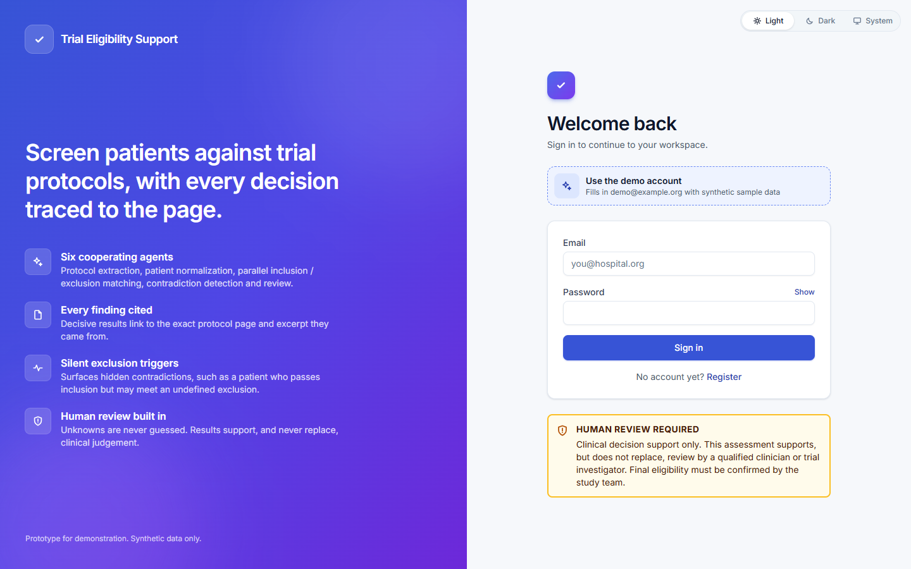

- Click **Use the demo account** to fill in the synthetic demo credentials, then **Sign in**.
- **Register** creates a personal account. Each user sees only their own protocols, patients and
  assessments.
- The **Light / Dark / System** switch in the top-right corner sets the colour theme.

## 2. Dashboard

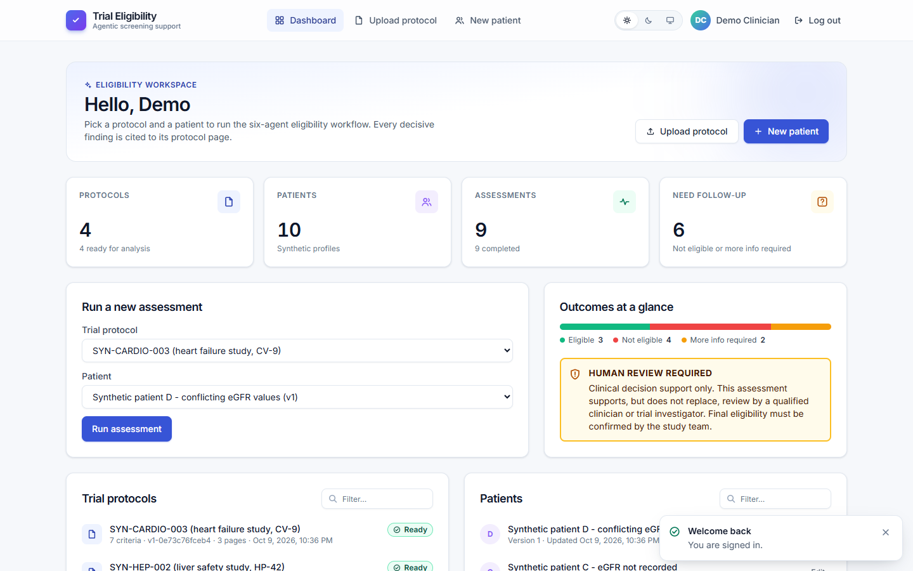

| Area | What it does |
|---|---|
| Stat cards | Count of protocols, patients, assessments, and results that need follow-up |
| Run a new assessment | Pick a ready protocol and a patient, then **Run assessment** |
| Outcomes at a glance | How past assessments split between the three outcomes |
| Trial protocols / Patients | Lists with a filter box (shown when a list has more than three items) |
| Recent assessments | Click a row to open its result; the chips filter by outcome |

## 3. Themes

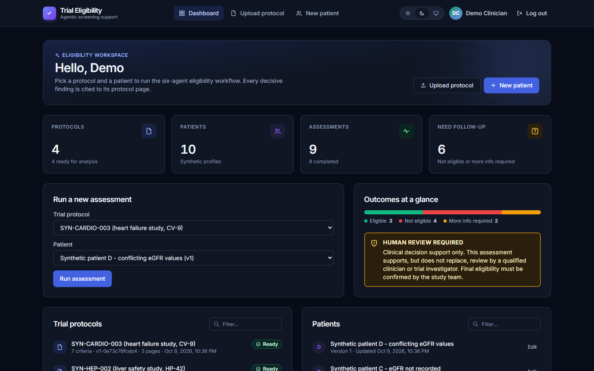

The switch in the header has three settings:

- **Light** or **Dark**: always use that theme.
- **System**: follow the operating system's setting. It updates live when the OS switches.

Your choice is remembered in this browser. Statuses always carry a text label as well as a
colour, so they stay readable in both themes and for colour-blind users.

## 4. Upload a protocol

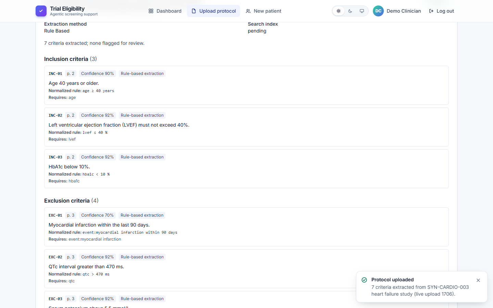

1. Open **Upload protocol**. Drag a PDF onto the drop zone, or click **Choose PDF file**. The
   limit is 20 MB, and the PDF must contain text (not a scan).
2. Optionally give it a title, then click **Upload and extract**.
3. The extracted inclusion and exclusion criteria appear. Each one shows its machine-readable
   rule and the page it came from. Criteria the extractor could not turn into a rule are marked
   for human review.

## 5. Add a patient

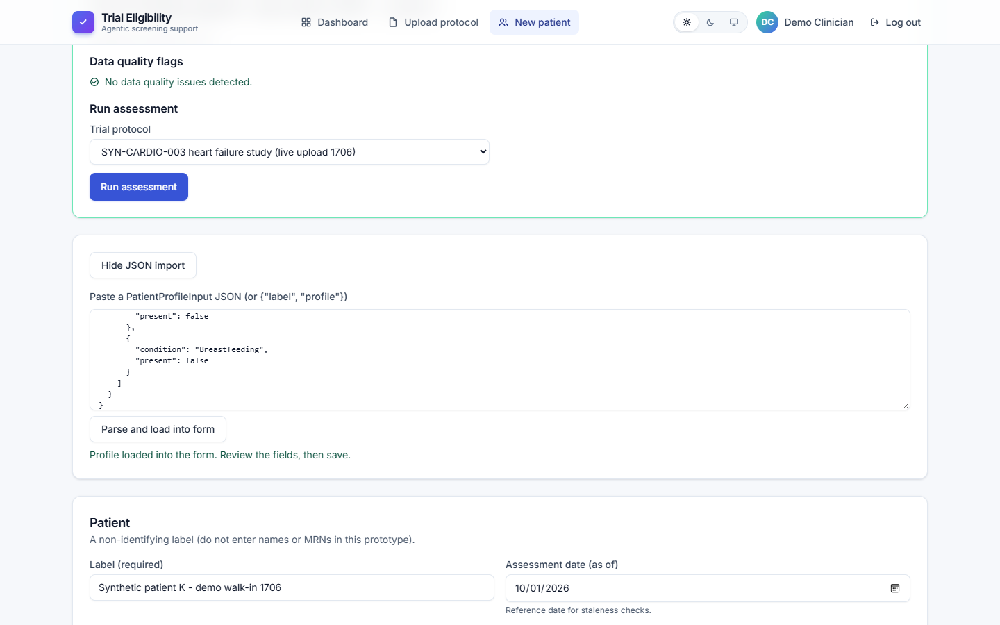

1. Open **New patient**.
2. Fill in the form: label, assessment date, age, sex, then labs, diagnoses, medications and
   history. Leave anything you don't know empty; it is reported as missing, never assumed.
   You can also click **Load JSON** and paste a structured profile; the files in
   `backend/tests/fixtures/patient_*.json` are examples.
3. Click **Create patient**. The app shows data-quality flags straight away, such as stale or
   conflicting values and unit problems.
4. Run an assessment for that patient from the same screen.

Editing a patient creates a new **version**. Past assessments keep the version they used.

## 6. Watch the agents work

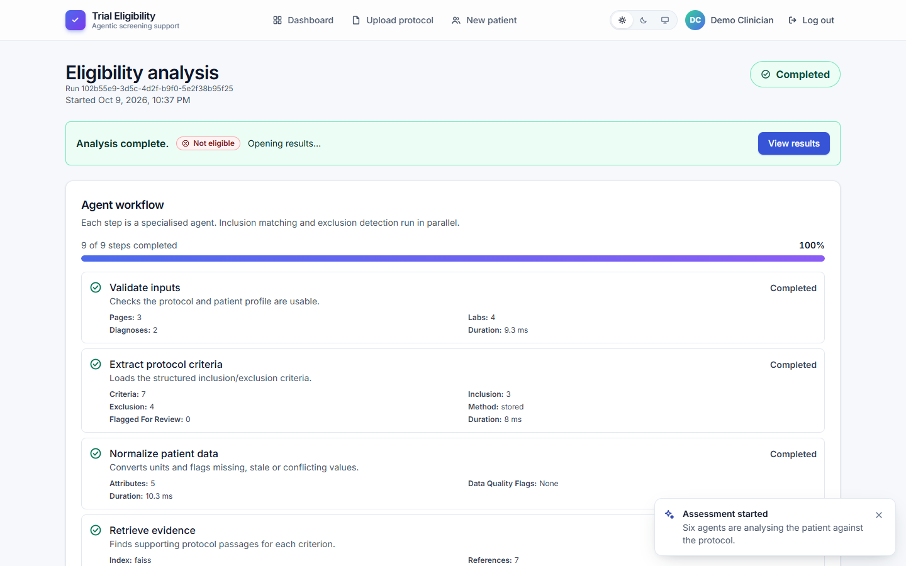

The analysis page shows each agent live: validate inputs, extract criteria, normalize the
patient, retrieve evidence, **inclusion matching and exclusion detection in parallel**, detect
contradictions, review and decide, then save. When it finishes, the results page opens on its own.

## 7. Read the result

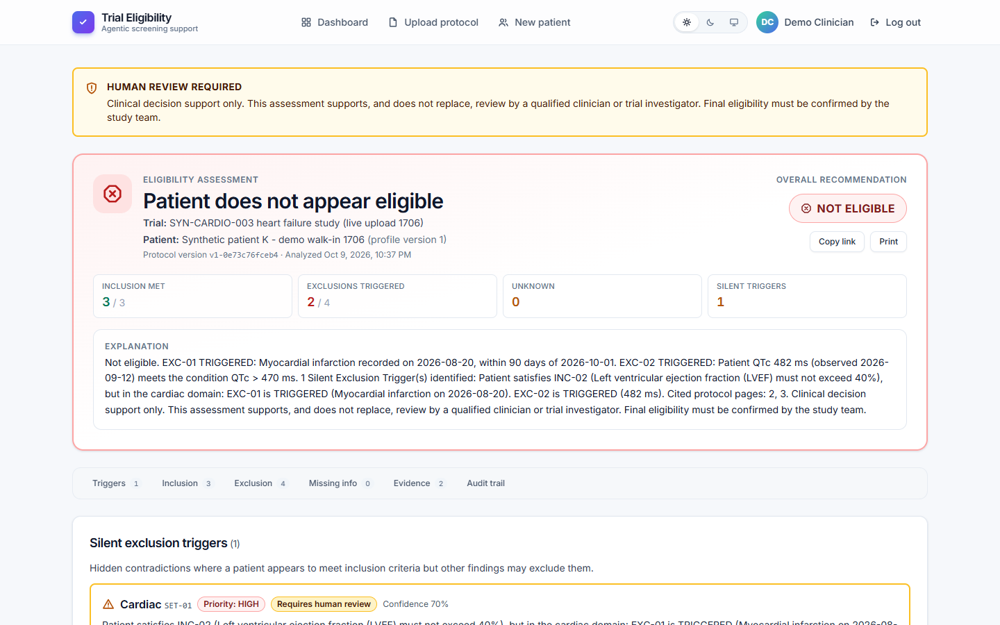

- **Verdict:** the overall recommendation, with counts of inclusion criteria met, exclusions
  triggered, unknowns and silent triggers, plus a plain-language explanation.
- **Section bar:** jump to Triggers, Inclusion, Exclusion, Missing info, Evidence or Audit trail.
  It stays pinned while you scroll.
- **Silent exclusion triggers:** hidden contradictions, for example a patient who passes
  inclusion but whose findings point to an exclusion the protocol never defines numerically.
  These are always flagged for human review.
- **Criteria tables:** status, rule, patient value, reasoning and evidence for every criterion.
  The coloured left edge mirrors the status.
- **Copy link** and **Print** are next to the verdict.

### Evidence drawer

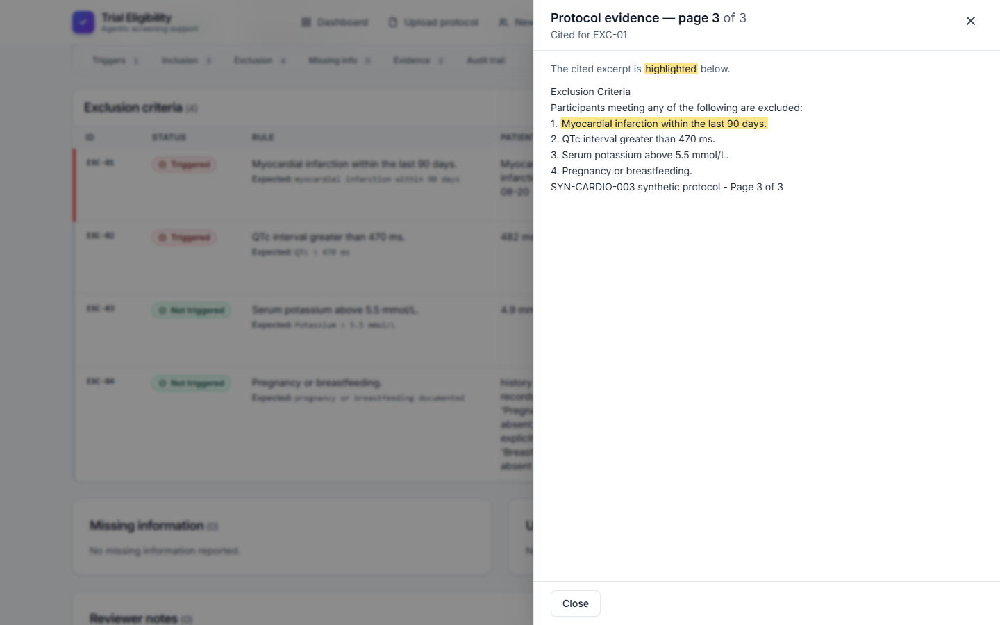

Click any **p. N** pill to open the protocol page with the cited excerpt highlighted. Press
`Esc` or click the close button to close it.

### The renal example

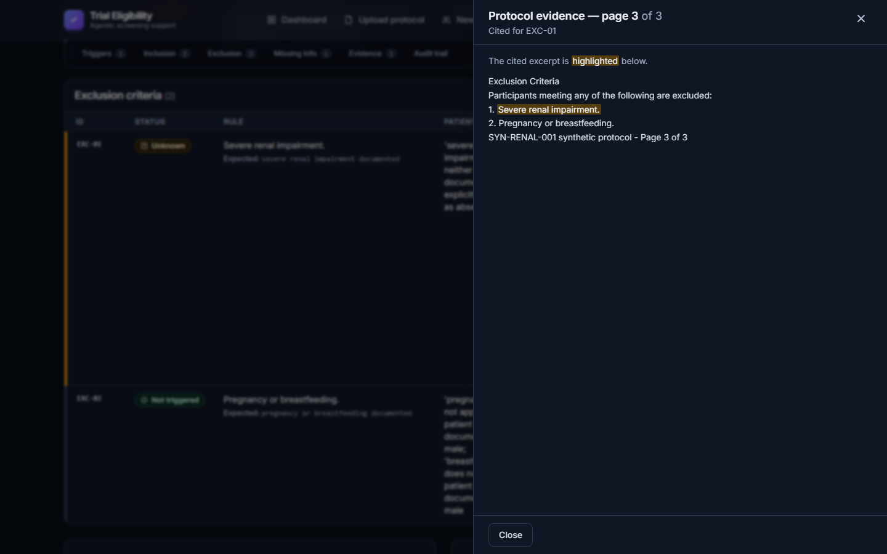

For **Synthetic patient A** (age 69, eGFR 28) against **SYN-RENAL-001**:

- Age is within range, so INC-01 is satisfied (p. 2).
- eGFR 28 is below 30, so INC-02 is unsatisfied (p. 2).
- The protocol excludes "severe renal impairment" (p. 3) without defining it. The system does not
  infer a diagnosis from a lab value, so EXC-01 is **Unknown** and flagged: *not confirmed by eGFR
  alone*.
- A renal silent exclusion trigger links pages 2 and 3.
- Overall: **Not eligible**.

## 8. On a phone

  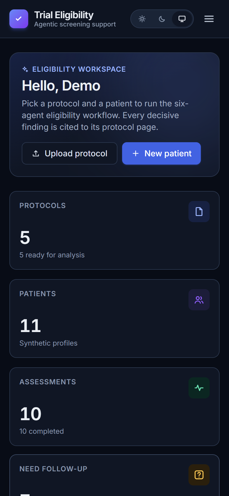
  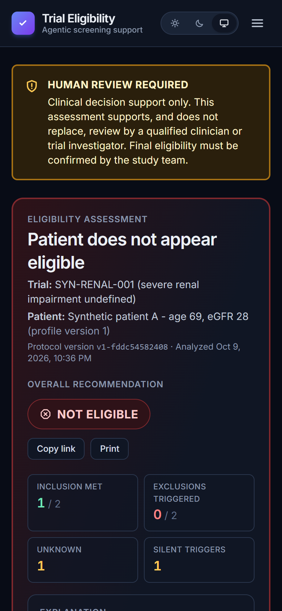

Every screen works at phone width. Navigation moves into the menu button, and the criteria
tables become stacked cards.

## Troubleshooting

| Symptom | Fix |
|---|---|
| The first page load hangs for about a minute | The free Render service is waking up; wait, then retry |
| "No trial is ready for analysis yet" | The protocol is still processing; refresh the dashboard |
| Upload fails with UNREADABLE_PDF | The PDF is scanned or encrypted; export a text-based PDF |
| Result is "More information required" | Open **Missing info**: add the missing or current values to the patient and run again |
| Signed out unexpectedly | The session token expired; sign in again |
